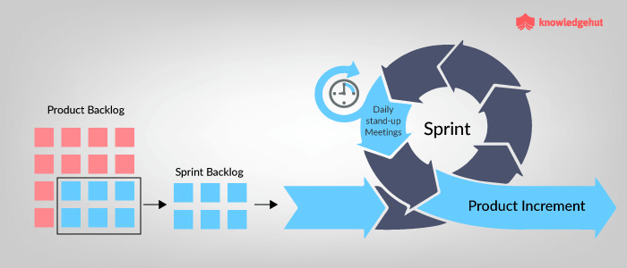

# Sprint planning

_Objetivo:_ Pegar alguns itens do backlog para fazer parte do Sprint

* Entradas: Oportunidades de aumentar o valor
* Quem participa: Stakeholders e Equipe Scrum
* Saídas: as tarefas que serão realizadas

## Execução

* Criar os entregáveis
* Realizar Daily Scrums
* Refinar o Product Backlog

| Items | To do | WorkInProgress | Done |
| ----- | ----- | -------------- | ---- |
|		|		|				 |		|
|		|		|				 |		|

# Sprint Review

* Inspecionar e avaliar os resultados da equipe e adaptar para os próximos passos. Em outras palavras, a função do Sprint Review é 
diminuir a distância entre os clientes e a equipe Scrum.

_Incremento:_ um passo em direção ao Product Goal.

